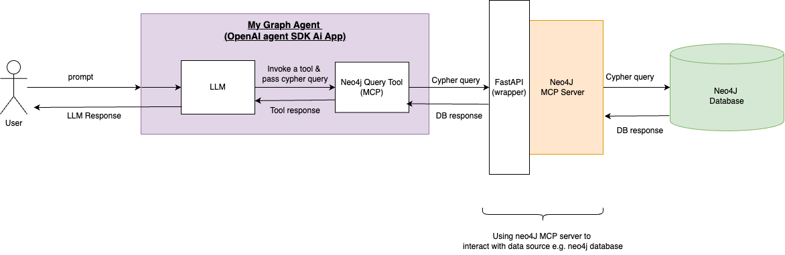

# OpenAI Agent SDK App (MCP Server Integration with Neo4j Database)

This guide helps you connect an OpenAI Agent to a Neo4j database using an MCP server wrapped in FastAPI.


---

## 📌 Overview Diagram

  
*Using an MCP server to bridge AI agents and a Neo4j graph database.*

---

## 📦 Part 1: Database Preparation (Install Neo4j & Create a Sample Graph)

### Option 1: Run with Docker

```bash
docker run \
  --name neo4j-test \
  -p7474:7474 -p7687:7687 \
  -e NEO4J_AUTH=neo4j/your-password \
  neo4j:5

```

1. Open in browser: http://localhost:7474/browser/

2. Login using:
    - Username: neo4j
    - Password: your-password

3. Run the following Cypher commands to create nodes and relationships:

    ```bash
        CREATE (a:Person {name: "Alice"});
        CREATE (b:Movie {title: "The Matrix"});
        CREATE (a)-[:LIKES]->(b);
    ```

4. Verify creation:

    ```bash
    MATCH (n) RETURN n;
    ```

## 📦 Part 2: MCP Server Setup (Neo4j + FastAPI)

1. Clone the MCP server:

```bash
    git clone https://github.com/neo4j-contrib/mcp-neo4j.git
    cd mcp-neo4j
```

2. Navigate to the server folder:

```bash
    cd servers/mcp-neo4j-cypher
```
3. Install dependencies:

```bash
    poetry install
```
4. Create a .env file and add your DB credentials:

```bash
    NEO4J_URI=bolt://localhost:7687
    NEO4J_USERNAME=neo4j
    NEO4J_PASSWORD=your-password
```

5. Create a "fastapi_wrapper.py" file at the root of this folder and add FastAPI code to expose the MCP server over HTTP.

- Run the server:

```bash
    poetry run uvicorn fastapi_wrapper:app --host 0.0.0.0 --port 8000
```

## 📦 Part 3: AI Agent App (OpenAI Agent SDK)

1. Initialize a new project using uv:

```bash
    uv init my-agent-app
    cd my-agent-app
```
2. Create a virtual environment and activate it:

```bash
    uv venv
    source .venv/bin/activate
```

3. Install dependencies:

```bash
    uv add openai-agents python-dotenv
```

4. Create a .env file:

```bash
    OPENAI_API_KEY=your-api-key
```

5. Create a file my_graph_agent.py with:

    - An OpenAI Agent

    - A tool that sends Cypher queries to the MCP server

    - A prompt to test it

6. Run the agent:

```bash
uv run my_graph_agent.py

```

## Example Output
```bash
    [TOOL] Sending query to Neo4j MCP: MATCH (p:Person)-[:LIKES]->(m:Movie {title: 'The Matrix'}) RETURN p.name
    [TOOL] Response: 200 - {"results":[{"name":"Alice"}]}

    CALLING AGENT

    Agent response: Alice likes "The Matrix."

```
